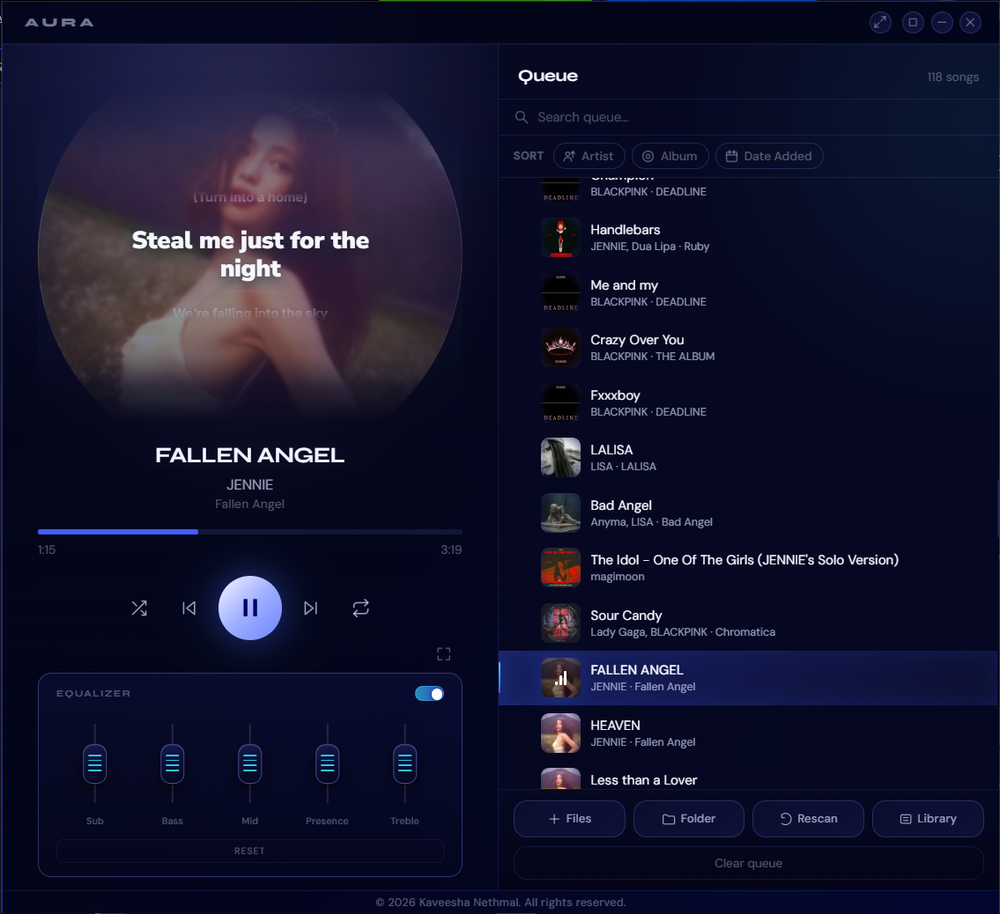

<div align="center">
  

# Aura Music Player

### A polished local desktop music player built with Electron.

Aura is a modern, offline-first music player for people who want a beautiful local library experience without the weight of a full streaming app. It focuses on clean UI, album-art-driven visuals, synced lyrics, queue control, waveform seeking, and a compact 9:16 player layout that can expand into a full queue view when needed.




</div>

---

## Overview

Aura is designed around a two-panel desktop layout:

- **Player panel** — a focused 9:16 music player with rotating album art, lyrics overlay, waveform, controls, volume, and equalizer.
- **Queue panel** — a searchable, reorderable queue with library actions and current-track status.
- **Collapsible mode** — the queue can collapse so Aura becomes a compact single-panel player.

The app reads local audio files, extracts metadata and album art, builds a persistent library, caches covers and lyrics in the app data folder, and keeps the actual music files untouched.

---

## Preview

Place your screenshot here:

```text
docs/
└── screenshots/
    └── aura-main.png
```

Recommended screenshot size: **900 × 824 px** or a clean crop of the full app window.

---

## Features

### Music library

- Add individual audio files.
- Add full folders recursively.
- Drag and drop files or folders directly onto the app.
- Rescan saved library sources.
- Manage saved folders and loose files from the built-in Library modal.
- Clear Aura's saved library sources without deleting real music files.
- Deduplicates songs using metadata-aware scoring.
- Caches scanned metadata so startup stays faster after the first scan.

### Audio playback

- Play, pause, previous, and next controls.
- Shuffle mode.
- Repeat off, repeat all, and repeat one.
- Clickable waveform seeking.
- Drag seekbar scrubbing.
- Volume slider with mute/unmute icon.
- Automatic skip attempt when an audio file fails to load.

### Queue

- Search the queue by title, artist, album, or path.
- Click any track to play it.
- Remove individual tracks from the queue.
- Clear the whole queue.
- Drag tracks to reorder.
- “Play next” action for quickly moving a song after the current track.
- Current-track visual indicator with mini equalizer animation.
- Queue collapse/expand button that resizes the Electron window.

### Visual design

- Frameless transparent Electron window.
- Custom titlebar and window controls.
- Compact 9:16 player panel.
- Expandable side-by-side queue panel.
- Rotating disc-style album cover while playing.
- Album-art glow and dynamic visual treatment.
- Smooth transitions and polished interaction states.
- App footer with copyright text.

### Metadata and album art

- Uses `music-metadata` to read common tags.
- Reads title, artist, album, duration, year, genre, track number, disc number, bitrate, and sample rate where available.
- Extracts embedded album art.
- Supports sidecar cover images named after the audio file.
- Crops and stores covers as optimized 512 × 512 JPEG files in the user data folder.

### Lyrics

- Searches lyrics using LRCLIB.
- Supports synced LRC lyrics when available.
- Falls back to plain lyrics and estimates line timing.
- Shows previous, current, and next lyric lines over the album-art area.
- Caches lyrics permanently in the app data folder.
- Avoids endless lookups by stopping after four attempts.
- Double-click the cover area to refresh lyrics for the current song.

### Equalizer

- Built-in 5-band Web Audio equalizer.
- Bands: Sub, Bass, Mid, Presence, and Treble.
- Toggle EQ on/off.
- Reset all bands.
- Drag vertical sliders to adjust gain.
- Double-click a band to reset that band.

### System integration

- Media Session API metadata support.
- Windows/media-key style actions for play/pause, next, and previous.
- Secure preload bridge using Electron `contextBridge`.
- Uses app data storage instead of writing generated library/cache files into the install directory.

---

## Supported audio formats

Aura scans and accepts the following extensions:

```text
.mp3, .flac, .wav, .ogg, .m4a, .aac, .opus, .wma, .aiff, .aif, .mp4, .m4b
```

Sidecar cover images can use:

```text
.jpg, .jpeg, .png, .webp, .bmp
```

For sidecar covers, use the same base filename as the audio file, for example:

```text
song-name.mp3
song-name.jpg
```

Aura also checks nearby cover folders such as `covers/`, `cover/`, and `artwork/` using the same base filename.

---

## Keyboard shortcuts

| Shortcut | Action |
|---|---|
| `Space` | Play / pause |
| `←` | Seek backward 5 seconds |
| `→` | Seek forward 5 seconds |
| `Alt + ←` | Previous track |
| `Alt + →` | Next track |
| `↑` | Volume up |
| `↓` | Volume down |
| `S` | Toggle shuffle |
| `R` | Cycle repeat mode |
| `Esc` | Close Library modal |

---

## Tech stack

| Layer | Technology |
|---|---|
| Desktop shell | Electron |
| Runtime | Node.js |
| UI | HTML, CSS, JavaScript |
| Audio playback | HTMLAudioElement |
| Waveform | Web Audio API / decoded audio data |
| Equalizer | Web Audio API `BiquadFilterNode` |
| Metadata | `music-metadata` |
| Packaging | `electron-builder` |
| Lyrics provider | LRCLIB |

---

## Getting started

### Prerequisites

Install:

- Node.js **18 or newer**
- npm

### Install dependencies

```bash
npm install
```

### Run the app

```bash
npm start
```

For development mode:

```bash
npm run dev
```

---

## Adding music

You can add songs in three ways:

### 1. Add files

Click **Files** and select one or more audio files.

### 2. Add folders

Click **Folder** and select one or more folders. Aura will scan audio files inside those folders recursively.

### 3. Drag and drop

Drop audio files or folders anywhere on the app window.

Aura saves selected folders and loose files as library sources. On the next launch, it loads the saved library again.

---

## Library manager

Open **Library** from the queue panel to manage:

- saved folders,
- manually added loose files,
- scanned songs.

Removing a folder or file from the Library modal only removes it from Aura's saved sources. It does **not** delete your actual files from disk.

---

## Build for distribution

Aura uses `electron-builder`.

### Windows

```bash
npm run build-win
```

Output: `dist/` with a Windows NSIS installer.

### macOS

```bash
npm run build-mac
```

### Linux

```bash
npm run build-linux
```

---

## Project structure

```text
aura-music-player/
├── assets/
│   ├── AURA-logo-icon-HQ.png
│   ├── AURA-icon2.ico
│   ├── aura-icon64.png
│   ├── auraicon.png
│   ├── icon.ico
│   ├── logo.png
│   └── logo2.png
├── src/
│   ├── index.html              # App layout and UI structure
│   ├── renderer.js             # Playback, queue, lyrics, EQ, library UI
│   ├── styles.css              # Current app styling and animations
│   └── styles-old-theme.css    # Older theme backup
├── main.js                     # Electron main process, scanning, cache, IPC
├── preload.js                  # Secure renderer bridge
├── package.json                # Scripts, dependencies, build config
├── package-lock.json
└── README.md
```

---

## App data and cache

Aura stores generated data inside Electron's `userData` directory, not inside the project folder or installation directory.

Generated data includes:

```text
data/
├── library.json      # Saved folders, loose files, scanned songs
├── covers/           # Optimized cached cover images
└── lyrics/           # Cached lyrics responses
```

This keeps the installed app cleaner and safer, especially after packaging.

---

## How screenshots should be stored on GitHub

Best option: keep screenshots inside the repository.

Use this path:

```text
docs/screenshots/aura-main.png
```

Then the README image line should stay like this:

```md

```

### Add the screenshot with Git

```bash
mkdir -p docs/screenshots
# Copy your screenshot into docs/screenshots/aura-main.png

git add README.md docs/screenshots/aura-main.png
git commit -m "docs: add detailed project readme and app screenshot"
git push
```

---

## Alternative: host the screenshot as a link

If you do not want to keep the screenshot inside the repo, you can host it using a GitHub issue or discussion upload.

### GitHub issue upload method

1. Open your GitHub repository.
2. Go to **Issues**.
3. Create a new issue draft.
4. Drag your screenshot into the issue text box.
5. GitHub will upload it and generate a URL like:

```md

```

6. Copy only the image URL or the full Markdown image line.
7. Paste it into the README.
8. You do not have to submit the issue; the uploaded image link usually remains usable.

Example:

```md

```

Repository-stored screenshots are usually better because they stay version-controlled with the project.

---

## Notes

- Lyrics require internet access because Aura searches LRCLIB.
- Playback itself is local once songs are added.
- The app does not delete or modify your original music files.
- If metadata is missing, Aura falls back to filename-based title and artist guessing.
- First scan can take longer for large libraries because metadata and cover art need to be extracted.

---

## Author

**Kaveesha Nethmal**

© 2026 Kaveesha Nethmal. All rights reserved.
