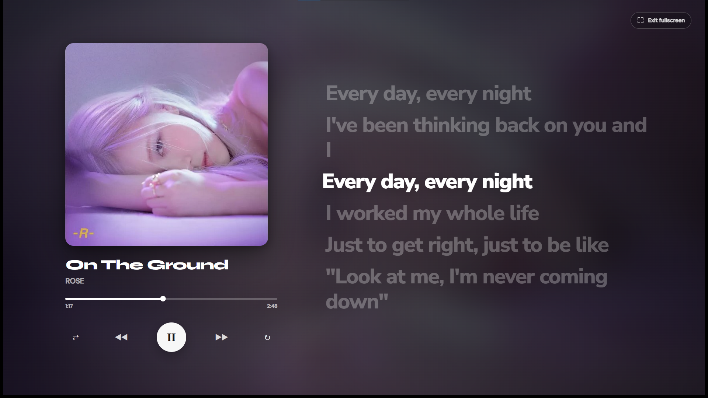

<div align="center">
  

# Aura Music Player

### A polished local desktop music player built with Electron.

Aura is a modern, offline-first music player for people who want a beautiful local library experience without the weight of a full streaming app. It focuses on clean UI, album-art-driven visuals, synced lyrics, persistent queue control, and an immersive fullscreen now-playing view.


<!-- Fullscreen screenshot placeholder: add docs/screenshots/aura-full-screen.png, then uncomment the line below. -->
<!--  -->


</div>

---

## Overview

Aura is designed around a flexible two-panel desktop layout:

- **Player panel** — a focused music player with rotating album art, lyrics overlay, a lightweight timeline, controls, volume, and equalizer.
- **Queue panel** — a searchable, sortable, reorderable queue with library actions and current-track status.
- **Collapsible mode** — the queue can collapse so Aura becomes a compact single-panel player.

- **Fullscreen now-playing mode** — a distraction-free player with blurred album-art background, static cover, full controls, and large synced lyrics.

The app reads local audio files, extracts metadata and album art, builds a persistent library, caches covers and lyrics in the app data folder, and keeps the actual music files untouched.

---


## Features

### Music library

- Add individual audio files.
- Add full folders recursively.
- Drag and drop files or folders directly onto the app.
- Rescan saved library sources.
- Manage saved folders and loose files from the built-in Library modal.
- Clear Aura's saved library sources without deleting real music files.
- Deduplicates songs using metadata-aware scoring.
- Caches scanned metadata so startup stays faster after the first scan.

### Audio playback

- Play, pause, previous, and next controls.
- Persistent Fisher-Yates shuffle that randomizes the actual queue, not each Next action.
- Repeat off, repeat all, and repeat one.
- Lightweight clickable timeline seeking.
- Drag seekbar scrubbing.
- Volume slider with mute/unmute icon.
- Automatic skip attempt when an audio file fails to load.

### Queue

- Search the queue by title, artist, album, or path.
- Click any track to play it.
- Remove individual tracks from the queue.
- Clear the whole queue.
- Drag tracks to reorder.
- Sort by artist, album, and date added, including multi-sort priority.
- “Play next” action for quickly moving a song after the current track.
- Current-track visual indicator with mini equalizer animation.
- Queue collapse/expand button that resizes the Electron window.
- Shuffle keeps the current song first, follows the visible order sequentially, preserves Previous history, and restores original order when disabled.

### Visual design

- Frameless opaque Electron window with square corners.
- Custom titlebar with minimize, maximize/restore, and close controls.
- Manually resizable player and queue layout.
- Expandable side-by-side queue panel.
- Rotating disc-style album cover only while the focused window is playing.
- Album-art glow and dynamic visual treatment.
- Smooth transitions and polished interaction states.
- App footer with copyright text.
- Dedicated fullscreen launcher above the equalizer, without disrupting the playback-control layout.

### Metadata and album art

- Uses `music-metadata` to read common tags.
- Reads title, artist, album, duration, year, genre, track number, disc number, bitrate, and sample rate where available.
- Extracts embedded album art.
- Supports sidecar cover images named after the audio file.
- Crops and stores covers as optimized 512 × 512 JPEG files in the user data folder.

### Lyrics

- Searches lyrics using LRCLIB.
- Supports synced LRC lyrics when available.
- Falls back to plain lyrics and estimates line timing.
- Shows previous, current, and next lyric lines over the album-art area.
- Gives the current compact-player lyric enough space for a wrapped second line.
- Shows six large lyric positions in fullscreen mode, with smooth directional movement and only the current line highlighted.
- Caches lyrics permanently in the app data folder.
- Avoids endless lookups by stopping after four attempts.
- Double-click the cover area to refresh lyrics for the current song.

### Equalizer

- Built-in 5-band Web Audio equalizer.
- Bands: Sub, Bass, Mid, Presence, and Treble.
- Toggle EQ on/off.
- Reset all bands.
- Drag vertical sliders to adjust gain.
- Double-click a band to reset that band.

### System integration

- Media Session API metadata support.
- Windows/media-key style actions for play/pause, next, and previous.
- Native fullscreen entry and exit with Esc and an in-view exit action.
- Secure preload bridge using Electron `contextBridge`.
- Uses app data storage instead of writing generated library/cache files into the install directory.

---

## Supported audio formats

Aura scans and accepts the following extensions:

```text
.mp3, .flac, .wav, .ogg, .m4a, .aac, .opus, .wma, .aiff, .aif, .mp4, .m4b
```

Sidecar cover images can use:

```text
.jpg, .jpeg, .png, .webp, .bmp
```

For sidecar covers, use the same base filename as the audio file, for example:

```text
song-name.mp3
song-name.jpg
```

Aura also checks nearby cover folders such as `covers/`, `cover/`, and `artwork/` using the same base filename.

---

## Keyboard shortcuts

| Shortcut | Action |
|---|---|
| `Space` | Play / pause |
| `←` | Seek backward 5 seconds |
| `→` | Seek forward 5 seconds |
| `Alt + ←` | Previous track |
| `Alt + →` | Next track |
| `↑` | Volume up |
| `↓` | Volume down |
| `S` | Toggle shuffle |
| `Shift + S` | Reshuffle upcoming songs while shuffle is active |
| `R` | Cycle repeat mode |
| `Esc` | Exit fullscreen mode or close the Library modal |

---

## Tech stack

| Layer | Technology |
|---|---|
| Desktop shell | Electron |
| Runtime | Node.js |
| UI | HTML, CSS, JavaScript |
| Audio playback | HTMLAudioElement |
| Timeline | HTML/CSS progress track |
| Equalizer | Web Audio API `BiquadFilterNode` |
| Metadata | `music-metadata` |
| Packaging | `electron-builder` |
| Lyrics provider | LRCLIB |

---

## Installation

Aura is distributed as a ready-to-install desktop app through GitHub Releases.

1. Go to the latest **Release** on this repository.
2. Download the Windows installer, usually named something like `Aura Music Player Setup.exe`.
3. Run the installer and open Aura.
4. Click **Files** to select songs, or **Folder** to select your music folder.
5. Done. Aura scans your music, builds the queue, and remembers your selected library sources for next time.


---

## Adding music

You can add songs in three ways:

### 1. Add files

Click **Files** and select one or more audio files.

### 2. Add folders

Click **Folder** and select one or more folders. Aura will scan audio files inside those folders recursively.

### 3. Drag and drop

Drop audio files or folders anywhere on the app window.

Aura saves selected folders and loose files as library sources. On the next launch, it loads the saved library again.

---

## Library manager

Open **Library** from the queue panel to manage:

- saved folders,
- manually added loose files,
- scanned songs.

Removing a folder or file from the Library modal only removes it from Aura's saved sources. It does **not** delete your actual files from disk.

---

## Project structure

```text
aura-music-player/
├── assets/
│   ├── AURA-logo-icon-HQ.png
│   └── icon.ico
├── src/
│   ├── index.html              # App layout and UI structure
│   ├── renderer.js             # Playback, queue, lyrics, EQ, library UI
│   └── styles.css              # Current app styling and animations
├── main.js                     # Electron main process, scanning, cache, IPC
├── preload.js                  # Secure renderer bridge
├── package.json                # Scripts, dependencies, build config
└── README.md
```

---

## App data and cache

Aura stores generated data inside Electron's `userData` directory, not inside the project folder or installation directory.

Generated data includes:

```text
data/
├── library.json      # Saved folders, loose files, scanned songs
├── covers/           # Optimized cached cover images
└── lyrics/           # Cached lyrics responses
```

This keeps the installed app cleaner and safer, especially after packaging.

---

## Notes

- Lyrics require internet access because Aura searches LRCLIB.
- Playback itself is local once songs are added.
- The app does not delete or modify your original music files.
- If metadata is missing, Aura falls back to filename-based title and artist guessing.
- First scan can take longer for large libraries because metadata and cover art need to be extracted.

---

## Author

**Kaveesha Nethmal**

© 2026 Kaveesha Nethmal. All rights reserved.<div align="center">
 
